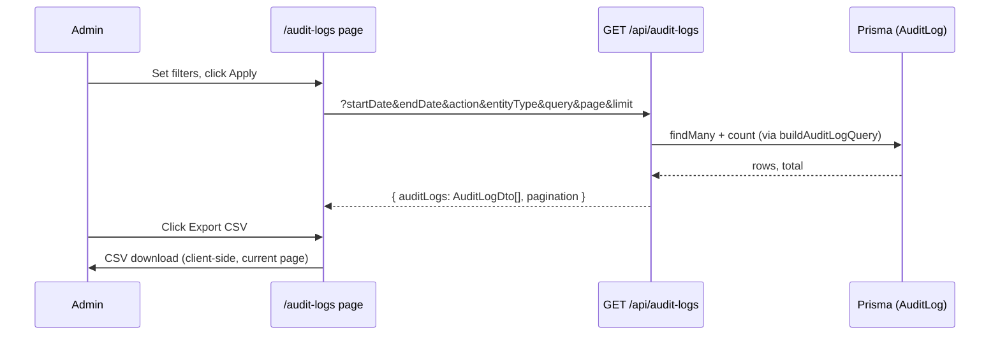

# Add an Admin Audit Log Viewer (`/audit-logs`)

**Type:** feature
**Date:** 2026-09-03
**Author(s):** AI assistant
**Related issue/PR:** none
**Addresses:** `docs/IMPROVEMENTS.md` — audit-log visibility item

---

## 1. Why

`logAuditEvent` has been writing `AuditLog` rows across every mutation
(auth, users, employees, payroll, settings, payslips, reports), but there
was no UI to read them: the only access path was querying the database
directly. Admins had no way to answer "who changed this setting and when?"
from inside the app.

## 2. What changed

- New admin-only page `/audit-logs` (`src/app/audit-logs/page.tsx`) with:
  - Filters: date range (defaults to last 30 days), action, entity type,
    free-text search.
  - Paginated table (50 rows/page) sorted newest-first, with actor email,
    employee ID, and description per row.
  - Expandable rows showing `oldValue` / `newValue` JSON diffs, entity ID,
    IP address, and business name.
  - "Export CSV" of the currently loaded page.
- New "Audit Logs" entry in `MainNav` (`src/components/MainNav.tsx`),
  visible only to roles holding `Permission.READ_AUDIT_LOGS` (ADMIN only)
  **and** only when the user has a business (`requiresBusiness: true`),
  matching the API route's access rules.
- Supporting refactor (same change set): the audit registry, filter types,
  DTO, and pure query builder moved to
  `src/lib/audit-constants.ts` (type-only Prisma import) so the client page
  can share the action/entity option lists with the API route without
  pulling the Prisma runtime into the browser bundle. `src/lib/audit.ts`
  re-exports everything and keeps only the write path (`logAuditEvent`,
  `getRequestIp`).

## 3. How it works

- The page imports option lists and types from `@/lib/audit-constants`
  only — never `@/lib/audit` — because the latter imports the Prisma
  client runtime (`DATABASE_URL` required) and must stay server-side.
- **Data fetching** goes through `GET /api/audit-logs`
  (`src/app/api/audit-logs/route.ts`), which is Zod-validated, ADMIN-only,
  and pins `businessId` to the session user's business.
- **CSV injection (CWE-1236)**: `exportCsv` uses the same
  `escapeCsvCell` convention as the reports exporter — cells starting
  with `=`, `@`, `+`, `-`, tab, or CR are prefixed with a single quote
  (doubled existing quotes), then RFC-4180-quoted
  (see `docs/bugsfix/0000-01-01-example-csv-injection-in-reports-exporter.md`).
  Description and JSON payload columns are user-influenced, so this is
  required, not optional.

## 4. Files touched

| File | Change |
| --- | --- |
| `src/app/audit-logs/page.tsx` | New client page |
| `src/components/MainNav.tsx` | New nav entry (permission-gated) |
| `src/lib/audit-constants.ts` | New — registry, DTO, query builder (moved out of `audit.ts`) |
| `src/lib/audit.ts` | Trimmed to write path; re-exports constants |
| `src/app/api/audit-logs/route.ts` | Existing route; imports unchanged (`@/lib/audit`) |
| `docs/UI.md` | Added `/audit-logs` section |

## 5. Testing

- `buildAuditLogQuery` is pure and covered by unit tests (filter → where
  clause mapping, pagination clamping, sort fallback).
- Manual verification: log in as ADMIN → Audit Logs appears in nav;
  filter by action `SETTINGS_UPDATED`; expand a row to see the old/new
  JSON; export CSV and open in Excel (no formula execution for
  malicious-looking cells).
- PAYROLL_OPERATOR / VIEWER roles: nav item hidden; direct `/audit-logs`
  visit renders the page but the API returns 403 and the error banner shows.

## 6. Limitations / follow-ups

- CSV export is limited to the current page (max 200 rows per API limit);
  a server-side "export all" endpoint is a follow-up if needed.
- Cross-business (SUPER_ADMIN) audit view remains intentionally
  unimplemented (Phase 9).
