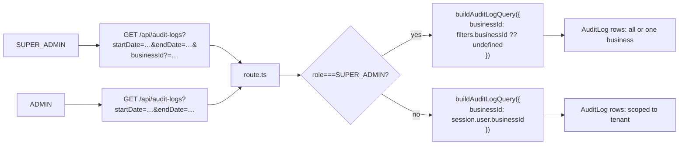

# Cross-business audit for SUPER_ADMIN

**Type:** feature
**Date:** 2026-09-03
**Author(s):** AI assistant
**Related issue/PR:** none

---

## 1. Why

Until this change, `SUPER_ADMIN` was explicitly *denied* audit-log access: `GET /api/audit-logs` required `Permission.READ_AUDIT_LOGS` (held by ADMIN only) and a `session.user.businessId` (SUPER_ADMIN has none), so the route returned 403. The locked decision for the SUPER_ADMIN-Only UI grants `READ_AUDIT_LOGS` to SUPER_ADMIN and exposes a cross-business view with an optional business filter — consistent with Phase 9's "granted explicitly, never implicitly" rule (SUPER_ADMIN already holds `MANAGE_BUSINESSES`).

## 2. What changed

- `src/lib/auth/permissions.ts:19` — `READ_AUDIT_LOGS` added to `SUPER_ADMIN`'s permission list.
- `src/lib/audit-constants.ts:15` — `AuditLogFilters.businessId` is now `string | null` (optional); `buildAuditLogQuery` only pins `businessId` in the Prisma `where` when the caller supplies one. The `AuditLogFilters` docstring and the `buildAuditLogQuery` docstring are updated to describe the SUPER_ADMIN path.
- `src/app/api/audit-logs/route.ts:39` — the gate now allows SUPER_ADMIN through with no `session.user.businessId`. An optional `?businessId=` query filter narrows the result set; for non-SUPER_ADMIN the value is ignored and the session's tenant is used (defense in depth: the schema accepts the value, the route does not forward it).
- `src/app/audit-logs/page.tsx:1` — when `useCurrentUser().role === 'SUPER_ADMIN'`, the page fetches `GET /api/businesses` and shows a **Business** filter `<select>`; the value is forwarded as `?businessId=`.

## 3. How it works

The pure `buildAuditLogQuery` continues to return index-aligned Prisma `where` clauses: the `timestamp` range (when present) is what the planner uses for the scan. The existing 10k-row performance test in `src/lib/audit-constants.test.ts` continues to assert the `(businessId, timestamp)` alignment for the always-business-scoped path.

## 4. What got better

- **Operational visibility**: SUPER_ADMIN can investigate incidents across tenants from a single view, or narrow to one business via the dropdown.
- **No schema change**: the same `(businessId, timestamp)` index serves both the cross-business (no `businessId` equality) and single-business (with `businessId` equality) access paths; the timestamp range is the filter in both cases.
- **Consistency with Phase 9**: SUPER_ADMIN is the single role with both `MANAGE_BUSINESSES` and `READ_AUDIT_LOGS`, keeping the "grant explicitly, audit implicitly" rule.

## 5. Risks and trade-offs

- Cross-business audit is a privilege grant. The 403 path remains for any role that does not hold `READ_AUDIT_LOGS` (PAYROLL_OPERATOR, VIEWER); asserted by test.
- The audit log may now contain rows attributed to businesses the SUPER_ADMIN has not explicitly selected. This is by design — the dropdown is a *narrowing* control, not a *scoping* one.

## 6. Test plan

- `src/app/api/audit-logs/__tests__/route.test.ts`:
  - 401 without a session
  - ADMIN is still scoped (Biz A only, Biz B hidden)
  - SUPER_ADMIN sees both Biz A and Biz B rows
  - SUPER_ADMIN with `?businessId=BizB` sees only Biz B
  - VIEWER (no `READ_AUDIT_LOGS`) → 403
- Existing `audit-constants.test.ts` (Phase 8) still passes — it tests the always-business-scoped query builder path with a 10k-iteration performance budget.
