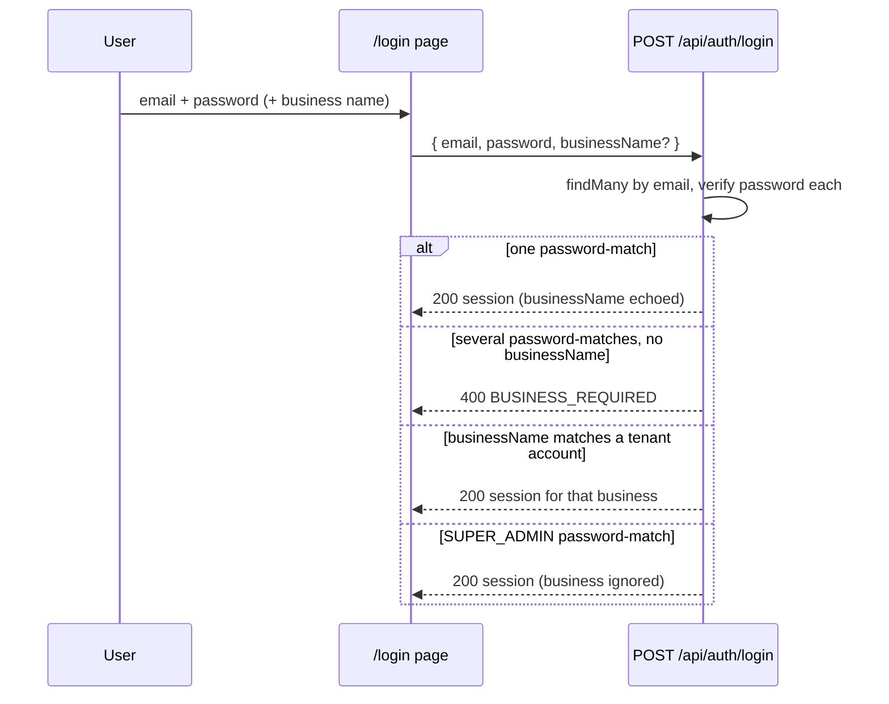

# Scoped login by business name with per-business email uniqueness

**Type:** feature
**Date:** 2026-09-03
**Author(s):** AI assistant
**Related issue/PR:** none

---

## 1. Why

One person can work for two businesses, so the same email address must be
able to hold an account in each. Until now `User.email` was globally `@unique`
(`prisma/schema.prisma`), which made that impossible at the database level —
the second account was rejected outright. And even once duplicates are
allowed, `POST /api/auth/login` looked users up by email alone
(`src/app/api/auth/login/route.ts`), so it could not know *which* business's
account the user meant. See `docs/IMPROVEMENTS.md` (multi-tenancy hardening).

## 2. What changed

- User email is now unique **per business** (`@@unique([email, businessId])`,
  migration `20260903235900_scoped_user_email_per_business`). SUPER_ADMIN rows
  (`businessId = NULL`) stay globally unique via a partial index.
- The login form has a **Business name** field. It is required only when the
  email + password match more than one account; otherwise it is optional.
- **SUPER_ADMIN is exempt**: a superadmin logs in with email + password only
  (a supplied business name is ignored, never rejected).
- Forgot-password accepts the same optional business name; without one, every
  account sharing the address gets its own reset token.
- User/admin create/update duplicate-email guards are scoped to the target
  business instead of global. Creating a business with an initial admin whose
  email exists elsewhere is now allowed.
- Users of a deactivated (`INACTIVE`) business can no longer log in.

## 3. How it works

- Schema: `prisma/schema.prisma` (`User` model) + hand-authored migration
  `prisma/migrations/20260903235900_scoped_user_email_per_business/migration.sql`
  (the `migrate dev` flow hangs without an interactive DB here, so the SQL
  follows the existing migration style and was applied with
  `migrate deploy` to both dev and test databases):
  ```sql
  DROP INDEX "users_email_key";
  CREATE UNIQUE INDEX "users_email_business_id_key" ON "users"("email", "business_id");
  CREATE UNIQUE INDEX "users_email_no_business_key" ON "users"("email") WHERE "business_id" IS NULL;
  ```
  The partial index is needed because Postgres treats `NULL` as distinct in
  composite unique constraints, so `(email, NULL)` alone would permit
  duplicate SUPER_ADMIN emails.
- Schemas: `loginSchema` / `forgotPasswordSchema` in
  `src/lib/auth/schemas.ts` gained optional `businessName` (trimmed, ≤200).
- Login (`src/app/api/auth/login/route.ts`): loads **all** users with the
  email (`findMany`), verifies the password per candidate, then selects:
  explicit business name (case-insensitive `Business.name` match) wins; else a
  `SUPER_ADMIN` password-match logs in; else a single remaining match logs in;
  else `400 { code: 'BUSINESS_REQUIRED' }` asking for the business name.
  Wrong-business and unknown-email failures keep the generic
  `401 Invalid email or password` (no enumeration). `LOGIN_FAILED` audits
  record the attempted business name.
- UI: `src/app/login/page.tsx` (new Business name input, no helper caption;
  surfaces `BUSINESS_REQUIRED` as a field error) and
  `src/app/forgot-password/page.tsx` (same optional field, with helper caption).
- Scoped guards: `src/app/api/users/route.ts` (POST checks
  `{ email, businessId }`), `src/app/api/users/[id]/route.ts` and
  `src/app/api/admin/businesses/[id]/admins/[userId]/route.ts` (PUT checks
  `{ email, businessId, id: { not: self } }`),
  `src/app/api/auth/account/route.ts` (PATCH, same pattern),
  `src/app/api/admin/businesses/[id]/admins/route.ts` (POST scoped to the
  business), `src/app/api/businesses/route.ts` (global initial-admin guard
  removed by design).
- Seed (`prisma/seed.ts`): email-keyed `upsert` replaced with a
  `findFirst({ email, businessId })`-then-create/update helper, since `email`
  is no longer a unique key.
- Tests: `auth-flows.test.ts` gains "disambiguates one email shared by two
  businesses" (ambiguous → `BUSINESS_REQUIRED`; correct/case-variant name →
  right `businessId`; unknown name → generic 401) and "SUPER_ADMIN logs in
  without a business name" (with and without the field);
  `business-management.test.ts` flips "rejects a duplicate initial-admin
  email" to assert the cross-business reuse now succeeds with both accounts
  coexisting; `findUnique({ email })` call sites in tests moved to `findFirst`.



## 4. What got better

- **Before:** one email = one account globally; a second business could not
  onboard the same person under their email, and the login had no notion of
  *which* business was meant.
- **After (qualitative):** the same address holds per-business accounts; the
  login resolves ambiguity through the business name while SUPER_ADMIN keeps
  its password-only flow. No new dependencies; auditability unchanged
  (`LOGIN_SUCCESS` / `LOGIN_FAILED` still written per attempt).

## 5. Risks and trade-offs

- `Business.name` is not unique and is renameable, so two businesses with the
  same name (or a rename) re-introduce ambiguity for the affected email. The
  failure mode is a safe `BUSINESS_REQUIRED`/401, never a wrong-business
  login — but a future business-code/subdomain identifier would be more
  robust. Documented as a follow-up.
- Forgot-password with an email shared by N businesses sends N reset emails
  to the same inbox (each token is user-bound, so all links work). Accepted
  to preserve the no-enumeration guarantee; the optional business field lets
  users narrow it to one.
- Deactivated-business users now get `401` at login in addition to session
  invalidation on deactivate — a behavior change, but the safe direction.
- Migration is additive at the constraint level and existing emails are
  already globally unique, so it applies with no data conflicts (verified on
  both dev and test databases).

## 6. Test plan

- `npx tsc --noEmit` — clean.
- `npx eslint` over all touched files — clean.
- `npx vitest run src/lib/auth/__tests__/auth-flows.test.ts` — 11/11 pass
  (9 pre-existing + 2 new), against the migrated test DB.
- `npx vitest run …/business-management.test.ts` — 8/8 pass.
- `user-management` + `tenant-isolation` suites — pass (26 tests, no new
  failures).
- Manual: tenant login without business name → 200 (single account); shared
  email without name → `BUSINESS_REQUIRED` field error; with right name (any
  case) → correct business dashboard; SUPER_ADMIN blank → `/home`.

## 7. Follow-ups

- Consider a stable, unique business identifier (code/subdomain) as the login
  disambiguator instead of the free-text, renameable name.
- Surface the `selectedBusinessName` (already in `sessionStorage`) in the
  shell header so users always see which business they are acting in.
- Document the new login/forgot-password contracts in `docs/API.md` (done in
  this change) and add a `BUSINESS_REQUIRED` branch to any future native/mobile
  client.
