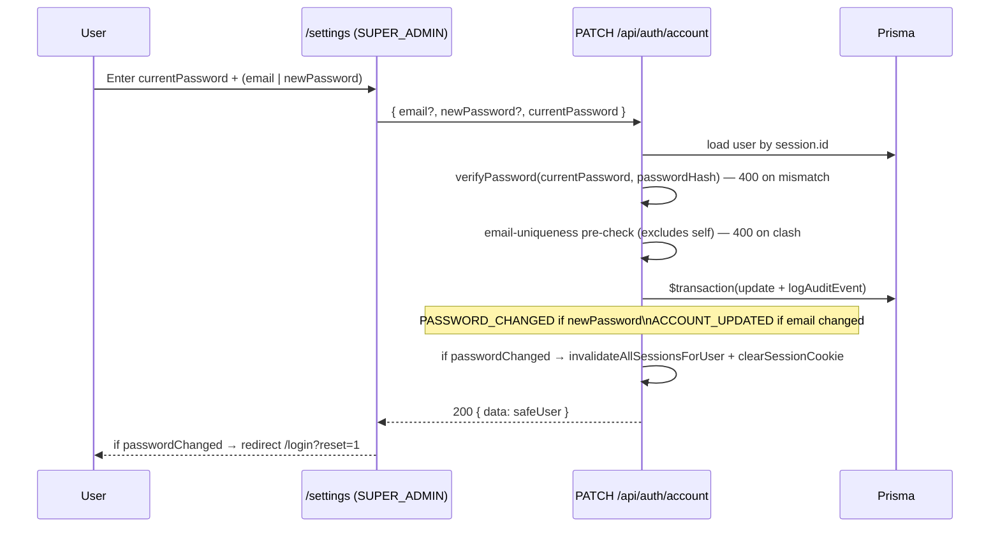

# Self-account update endpoint (`PATCH /api/auth/account`)

**Type:** feature
**Date:** 2026-09-03
**Author(s):** AI assistant
**Related issue/PR:** none

---

## 1. Why

`SUPER_ADMIN` previously had no way to change their own email or password from inside the app — they had to be rotated in the database directly. The locked decision in `.kilo/plans/1788431541283-superadmin-only-ui.md` calls for a `/settings` branch that posts to a dedicated endpoint.

## 2. What changed

- `src/app/api/auth/account/route.ts` — new `PATCH` handler.
- `src/lib/auth/schemas.ts` — new `updateOwnAccountSchema` (`{ email?, newPassword?, currentPassword }`).
- `src/app/settings/page.tsx:257` — new SUPER_ADMIN branch that renders an email + password form posting to the new endpoint.

## 3. How it works

Failure modes (asserted by tests):

- Wrong `currentPassword` → 400 "Current password is incorrect".
- No fields changed → 400 "No changes provided".
- Email collision with another user → 400 "Email already in use".
- `newPassword` satisfies the shared `passwordSchema` (≥ 8 chars, one uppercase, one number).
- Password change → all sessions invalidated, response cookie cleared (`Max-Age=0`).

## 4. What got better

- **Self-service**: a SUPER_ADMIN can rotate their own credentials from the browser; no DDL, no console.
- **Auditability**: every change writes an `ACCOUNT_UPDATED` and/or `PASSWORD_CHANGED` row in the same transaction as the user mutation. The row's `previousData`/`newData` are sanitized safe-user DTOs (no password hash).
- **Consistency**: the password-change side-effect (invalidate all sessions, clear cookie) matches the `reset-password` route.

## 5. Risks and trade-offs

- This endpoint is intentionally open to every authenticated user (it acts on the *caller's* account, not on a target). ADMIN/PAYROLL_OPERATOR/VIEWER can also use it; no new permission is required.
- The cookie is cleared *after* the transaction commits, so the current tab's request still sees the success response and can redirect.

## 6. Test plan

- `src/app/api/auth/account/__tests__/route.test.ts` — 8 cases:
  - 401 without session
  - 400 on wrong `currentPassword`
  - 400 on empty body
  - email-only change → 200, email updated
  - duplicate email → 400
  - password-only change → 200, sessions cleared, cookie cleared
  - both email + password change → 200
  - audit events `ACCOUNT_UPDATED` + `PASSWORD_CHANGED` written
- Manual: log in as SUPER_ADMIN, change password, verify forced re-login.
