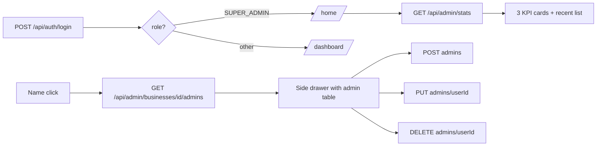

# SUPER_ADMIN-Only UI

**Type:** feature
**Date:** 2026-09-03
**Author(s):** AI assistant
**Related issue/PR:** none

---

## 1. Why

A `SUPER_ADMIN` user has no `businessId` and operates at the platform level, not the tenant level. The previous UI forced the SUPER_ADMIN to share the same sidebar as tenant users, but most of those tabs (Employees, Payroll, Payslips, Reports) were hidden and the only useful entry was **Businesses**. The platform role deserves a focused experience: a Home dashboard, Business Management, Settings (own account), and Audit Logs (cross-business).

See `docs/IMPROVEMENTS.md` for prior context and `docs/changes/2026-09-03-phase-9-business-management.md` for the foundation this builds on.

## 2. What changed

- A new SUPER_ADMIN-specific 4-tab nav: **Home · Business Management · Settings · Audit Logs**.
- A new `/home` page with three KPIs (businesses, admins, payroll records) and a recent-businesses list.
- Root URL `/` now does a role-aware server-side redirect: SUPER_ADMIN → `/home`, others → `/dashboard`.
- Login form `from` default switches by role after `/api/auth/login` resolves.
- The Businesses page now has ACTIVE / INACTIVE / ALL status chips, a side drawer (admin list, add admin, edit admin, deactivate admin) that opens on business name click, and a row-level Deactivate button.
- The Audit Logs page now offers a business filter dropdown for SUPER_ADMIN (cross-business view).
- The Settings page now branches by role: SUPER_ADMIN sees an email + password form (posting to the new `PATCH /api/auth/account` endpoint); the tenant UI is unchanged.

## 3. How it works

The full file inventory is in §4. The plan is tracked in `.kilo/plans/1788431541283-superadmin-only-ui.md`; this umbrella change links to the four child change files for endpoint and UI specifics.

## 4. Files touched (summary; per-file detail in the child change files)

### Edit
- `src/lib/auth/permissions.ts` — `READ_AUDIT_LOGS` added to `SUPER_ADMIN`.
- `src/lib/auth/schemas.ts` — `updateOwnAccountSchema` + `createBusinessAdminSchema`.
- `src/lib/audit-constants.ts` — `ACCOUNT_UPDATED` action; `businessId` filter is now optional (SUPER_ADMIN cross-business).
- `src/app/api/audit-logs/route.ts` — gate relaxed for SUPER_ADMIN; optional `businessId` query filter respected.
- `src/app/api/businesses/route.ts` — accepts optional `?status=ACTIVE|INACTIVE` filter.
- `src/app/page.tsx` — server-side role-aware redirect.
- `src/components/MainNav.tsx` — role-aware nav (SUPER_ADMIN 4-tab experience; others unchanged).
- `src/app/login/page.tsx` — `from` default is role-based on successful login.
- `src/app/businesses/page.tsx` — status filter chips, admin drawer, deactivate button, edit modal reactivated.
- `src/app/audit-logs/page.tsx` — business filter dropdown for SUPER_ADMIN.
- `src/app/settings/page.tsx` — SUPER_ADMIN branch (account form); tenant branch unchanged.

### Create
- `src/app/api/auth/account/route.ts` — `PATCH` self-account update.
- `src/app/api/admin/stats/route.ts` — `GET` platform counts + recent businesses.
- `src/app/api/admin/businesses/[id]/admins/route.ts` — `GET` + `POST`.
- `src/app/api/admin/businesses/[id]/admins/[userId]/route.ts` — `PUT` + `DELETE`.
- `src/app/home/page.tsx` — SUPER_ADMIN Home.

### Tests
- `src/lib/auth/__tests__/permissions.test.ts` — SUPER_ADMIN has `READ_AUDIT_LOGS`.
- `src/app/api/auth/account/__tests__/route.test.ts` — happy + error paths; session invalidation.
- `src/app/api/admin/__tests__/stats.test.ts` — counts reflect seeded data; ADMIN → 403.
- `src/app/api/admin/__tests__/admins.test.ts` — CRUD; ADMIN → 403; cross-business; wrong-biz 404.
- `src/app/api/audit-logs/__tests__/route.test.ts` — SUPER_ADMIN cross-business; ADMIN still scoped; business filter; VIEWER 403.

## 5. What got better

- **Focused role experience**: SUPER_ADMIN no longer sees tenant-only UI; the 4 tabs cover every action a platform operator can take.
- **Cross-business audit visibility** (granted explicitly, never implicitly): SUPER_ADMIN can read all `AuditLog` rows and filter by business.
- **Admin management for tenant onboarding**: SUPER_ADMIN can now create, edit, and deactivate business admins from the Businesses page without DB access.
- **Self-service account updates**: SUPER_ADMIN can change their own email/password from `/settings` (no DDL, no console).

## 6. Risks and trade-offs

- Adding `READ_AUDIT_LOGS` to SUPER_ADMIN is a privilege grant; it is consistent with Phase 9's "granted explicitly, never implicitly" decision (SUPER_ADMIN already holds `MANAGE_BUSINESSES`).
- `AuditLogFilters.businessId` is now optional; existing callers (the single-tenant `GET /api/audit-logs` flow for ADMIN) still pass it, so the 10k-row performance test in `audit-constants.test.ts` continues to assert the `(businessId, timestamp)` index alignment for the always-business-scoped path.
- No schema migration; no new dependencies. Existing tenant flows are untouched.

## 7. Test plan

- `npm run lint` clean.
- `npm test` green (the 5 new test files + existing engine and auth suites).
- Manual smoke: log in as `super@wiztech.com`, confirm 4 tabs, drawer opens on name click, add an admin, deactivate a business, change own password (verify forced re-login), verify cross-business audit rows + business filter.

## 8. Follow-ups

- The Businesses row-level Deactivate button is a one-way shortcut; reactivation happens through the Edit modal (consistent with the existing `PUT /api/businesses/[id]` semantics).
- Per-tenant settings UI for SUPER_ADMIN (a "view tenant settings" experience) is still out of scope.
- Notification email on business deactivation remains a documented future work item.
