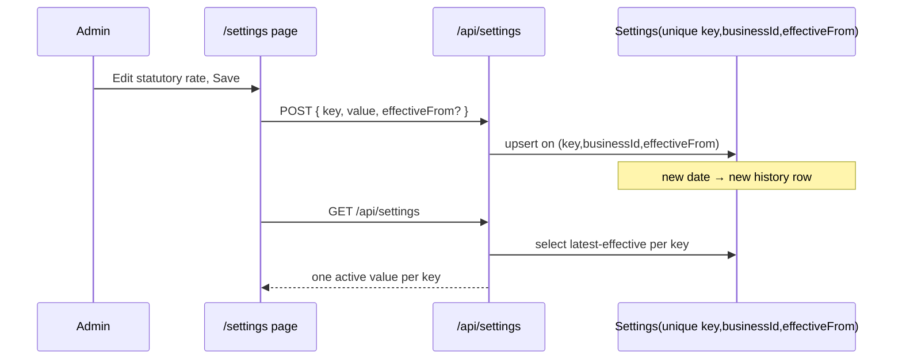

# Effective-Dated Settings History (the "historically reproducible" claim made real)

**Type:** feature
**Date:** 2026-09-08
**Author(s):** AI assistant
**Related issue/PR:** docs/IMPROVEMENTS.md H1

---

## 1. Why

`docs/README.md`, `docs/ARCHITECTURE.md` and `docs/IMPROVEMENTS.md` all claimed
that `Settings.effectiveFrom` lets the same key (e.g. `statutory.pension_ee_rate`)
hold multiple historical values, with the engine selecting the row effective at
the end of the pay period. The schema could never deliver that: the unique
constraint was `@@unique([key, businessId])` (**prisma/schema.prisma**), so one
key per business was the *only* option and every write overwrote the value,
making `selectEffectiveSettings` a pass-through. "Historically reproducible" was
therefore aspirational, not true.

## 2. What changed

- `Settings` is now unique on `(key, businessId, effectiveFrom)`, so the same
  statutory key can carry many effective-dated values.
- `selectEffectiveSettings` in `src/lib/payroll-engine.ts` deterministically
  resolves the single row with the greatest `effectiveFrom <= asOf` per key
  (missing `effectiveFrom` behaves like "always effective" for pre-history rows).
- `GET /api/settings` collapses to the latest-effective row per key so the
  client's `key → value` map and payslip/report defaults always see the active
  value.
- `POST /api/settings` upserts on the `(key, businessId, effectiveFrom)` tuple,
  so saving a new value with a new date inserts a history row instead of
  overwriting.
- `DELETE /api/settings` removes the key's *entire* history.
- `POST /api/settings/batch` `INSERT … ON CONFLICT` now targets
  `(key, business_id, effective_from)` and collapses its re-read the same way.
- The settings POST/PUT handlers' statutory pre-validation pass now collapses
  settings history via `selectEffectiveSettings` before building the config map,
  instead of a nondeterministic `Object.fromEntries` that could pick a
  non-latest row when multiple effective-dated values for the same key exist.

## 3. How it works

At payroll run time the engine resolves config via `selectEffectiveSettings(rows,
periodEnd)` so a January payslip uses the rates in force in January even after a
June change.

## 4. Migration

New migration `20260908120000_settings_effective_dated_history` drops the old
`(key, business_id)` unique and adds `(key, business_id, effective_from)`.
Because several earlier hand-written migrations use non-canonical index names,
the migration drops candidates defensively (`IF EXISTS`) and creates the new
index on the column tuple. **Apply with `prisma migrate deploy` and verify the
index name with `prisma migrate diff` in your environment before going live.**

## 5. Risks / follow-ups

- Each save that changes `effectiveFrom` grows a history row; the GET collapse
  keeps response shape identical.
- Prisma client regenerated (compound accessor `key_businessId_effectiveFrom`).
- Not covered by a DB integration test here (no test DB wired in this
  environment); the pure `selectEffectiveSettings` logic is unit-tested.