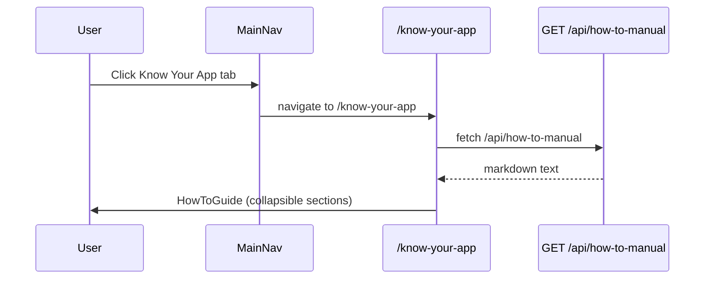

# 2026-09-11-know-your-app-how-to-manual

**Type:** feature
**Date:** 2026-09-11
**Author(s):** AI assistant
**Related issue/PR:** none

---

## 1. Why

There was no in-app guidance for WizTech Payroll features. Users had to
leave the app to find help, and the documentation that existed was spread
across `docs/` in forms hard to reach from the UI.

## 2. What changed

- Added a standalone **Know Your App** tab to the persistent navigation
  (`src/components/MainNav.tsx`) visible to `SUPER_ADMIN`, `ADMIN`, and
  `PAYROLL_OPERATOR`, hidden from `VIEWER`. It links to `/know-your-app` and
  is **not** a sub-tab of Settings.
- Added the `/know-your-app` route (`src/app/know-your-app/page.tsx`)
  rendering the new `HowToGuide` component.
- Added the role/section filtering module `src/lib/how-to-nav.ts`
  (`HOW_TO_NAV_ITEMS`, `canViewHowTo`, `getVisibleHowToItems`).
- Added `src/components/JumpToButton.tsx` — a dropdown that jumps to, or
  routes to, the matching section of the guide.
- Added `src/components/HowToGuide.tsx` — fetches the manual via
  `GET /api/how-to-manual`, filters sections by role, and renders
  collapsible `
` panels. Supports Print, Download, Jump To.
- Added `src/app/api/how-to-manual/route.ts` — serves
  `docs/how-to-manual.md` with role-based authorization.
- Added `docs/how-to-manual.md` — guide content.
- Added `react-markdown` and `remark-gfm` to `package.json`.
- Updated `docs/UI.md` and `docs/API.md`.

## 3. How it works

- `MainNav` keeps the existing permission filter for most tabs. The
  **Know Your App** entry carries a `howTo: true` flag and is gated by
  `canViewHowTo(user.role)`, mirroring the authorization enforced by both
  the route handler and the client component (no dead link for `VIEWER`).
- `HowToGuide` fetches the markdown (or accepts it via the `markdown` prop
  for embedded use), splits it on `##` headings, keeps only sections whose
  id is in `getVisibleHowToItems(role)`, and renders each section inside a
  `
` element keyed by `section.id`. Anchor hashes and the Jump To
  dropdown both call `scrollToSection`.
- The standalone page uses the full-page variant of `HowToGuide`. The
  earlier Back to Settings breadcrumb was removed because the tab is top-level.

## 4. Role-based visibility

| Role | Tab visible? | Manual sections |
|------|--------------|-----------------|
| SUPER_ADMIN | Yes | All |
| ADMIN | Yes | All |
| PAYROLL_OPERATOR | Yes | Per-SECTION_PERMISSIONS |
| VIEWER | No | n/a |

## 5. Risks / Trade-offs

- Adds two client deps (`react-markdown`, `remark-gfm`) — small bundle cost,
  loaded only on the guide route/component.
- Section ids are derived from `##` headings via `slugify`; keep headings
  stable to avoid breaking anchor links and the Jump To dropdown.

## 6. Test plan

- Log in as `SUPER_ADMIN`, `ADMIN`, `PAYROLL_OPERATOR`, `VIEWER`.
- Confirm the **Know Your App** tab appears for the first three roles and is
  absent for `VIEWER` (sidebar + mobile bottom nav).
- Open `/know-your-app` directly as `VIEWER` -> expect HTTP 403.
- Open the tab and confirm the guide renders with collapsible sections.
- Click **Jump To** -> the page scrolls to the selected section.
- Confirm **Download Manual** downloads `how-to-manual.md`.
- Confirm **Print / Save PDF** opens the print dialog.
- `npx tsc --noEmit` -> zero type errors. `npm run lint` on touched files ->
  0 errors, 0 warnings.

## 7. Follow-ups

- Server-side PDF generation (e.g. pandoc) is not wired up; Print / Save as
  PDF uses the browser print dialog.